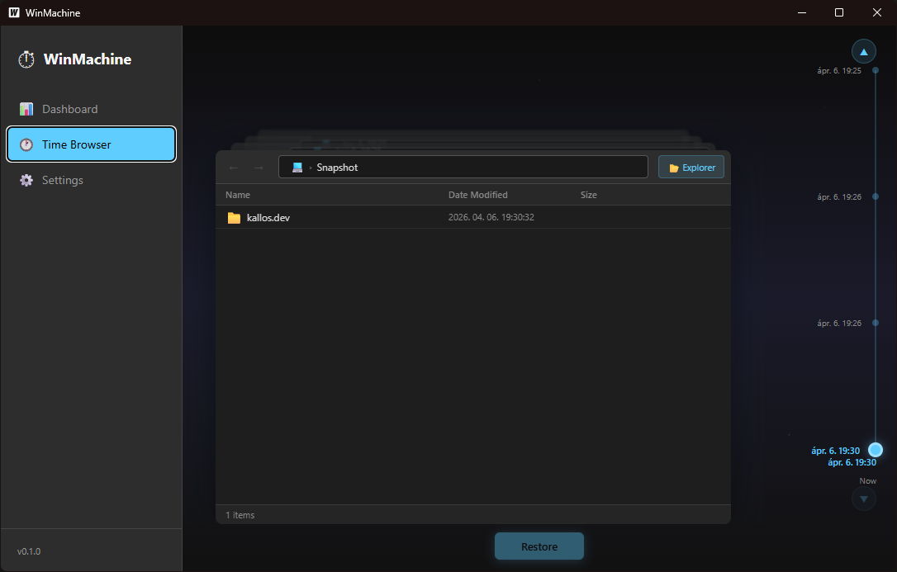

# WinMachine

Open-source Windows backup utility inspired by Apple Time Machine.

Creates incremental snapshots using NTFS hard links for space-efficient backups, with a macOS Time Machine-style 3D time browser UI.



> **⚠️ This project is under active development but already usable.** If you find any bugs or have suggestions, feel free to [open an issue](https://github.com/KallosLaszlo/winmachine/issues) or submit a pull request — contributions are welcome!

## Features

- **Incremental snapshots** — Only changed files are copied; unchanged files are NTFS hard-linked from the previous snapshot (zero extra disk space)
- **Time Browser** — 3D card-stack UI to browse and restore files from any point in time, with mouse wheel navigation and draggable timeline
- **Windows Explorer integration** — Mount any snapshot as a virtual drive letter via `subst`
- **SMB network share support** — Back up to NAS/network drives with saved credentials
- **Scheduled backups** — Configurable interval via cron (every 5 min to daily)
- **Per-machine snapshots** — Identified by hostname + Windows MachineGuid, safe for multi-PC backups to the same target
- **NTFS protection** — Snapshot directories are marked Hidden+System with NTFS ACLs (SYSTEM + Administrators only)
- **Retention policy** — Automatic pruning: keep hourly/daily/weekly/monthly snapshots
- **System tray** — Runs in background with tray icon, quick access to backup/pause/open
- **Auto-start** — Optional Windows startup registration via registry
- **Single .exe** — No installer needed, portable

## Tech Stack

| Component | Technology |
|-----------|-----------|
| Backend | Go 1.25+, [Wails v2](https://wails.io/) |
| Frontend | React 18 + TypeScript + Vite |
| Tray | [energye/systray](https://github.com/energye/systray) |
| Scheduler | [robfig/cron](https://github.com/robfig/cron) |
| Platform | Windows 10/11 (NTFS required) |

## Installation

Download the latest `WinMachine.exe` from the [Releases](https://github.com/KallosLaszlo/winmachine/releases) page and run it — no installer or dependencies required. It's a single portable executable.

> **Note:** Requires Windows 10/11 with an NTFS-formatted backup target drive.

## Building from Source

### Prerequisites

- **Go** 1.25+ — [download](https://go.dev/dl/)
- **Node.js** 18+ — [download](https://nodejs.org/)
- **Wails CLI** v2 — installed automatically by `buildme.bat`, or manually: `go install github.com/wailsapp/wails/v2/cmd/wails@latest`

### Quick Start

```bat
git clone https://github.com/KallosLaszlo/winmachine.git
cd WinMachine
buildme.bat
```

The script checks for Go, Node.js and Wails CLI, installs missing dependencies, and builds `build\bin\WinMachine.exe`.

## Development

```bat
wails dev
```

Runs a live-reload dev server with hot module replacement for the frontend.

## Project Structure

```
WinMachine/
├── main.go                    # Entry point, embeds frontend + icon
├── app.go                     # Wails bindings (all frontend-exposed methods)
├── internal/
│   ├── backup/
│   │   ├── engine.go          # Core backup logic with hard link dedup
│   │   ├── snapshot.go        # Snapshot listing, metadata, paths
│   │   ├── restore.go         # File/folder restore + snapshot browsing
│   │   └── retention.go       # Time-bucket pruning
│   ├── config/
│   │   └── config.go          # JSON config (source dirs, target, schedule, SMB)
│   ├── fsutil/
│   │   ├── hardlink.go        # NTFS hard link with copy fallback
│   │   ├── walker.go          # Directory walker with excludes
│   │   ├── volume.go          # NTFS detection, disk space
│   │   ├── machineid.go       # Hostname + MachineGuid identifier
│   │   └── protect.go         # Hidden+System attrs + NTFS ACL
│   ├── scheduler/
│   │   └── scheduler.go       # Cron-based scheduled backups
│   ├── smb/
│   │   └── smb.go             # Persistent SMB mount manager
│   └── tray/
│       └── tray.go            # System tray icon + menu
├── frontend/
│   └── src/
│       ├── App.tsx             # Main layout with sidebar navigation
│       ├── App.css             # All styles including Time Machine 3D UI
│       └── pages/
│           ├── Dashboard.tsx   # Status, stats, quick actions
│           ├── TimeBrowser.tsx # 3D snapshot browser
│           └── Settings.tsx    # Config: sources, target, SMB, schedule
├── build/
│   └── windows/
│       └── icon.ico           # Application icon
├── buildme.bat                # One-click build script
└── wails.json                 # Wails project config
```

## Configuration

Config is stored at `%APPDATA%\WinMachine\config.json`:

| Setting | Description |
|---------|------------|
| `sourceDirs` | Folders to back up |
| `targetDir` | Local or SMB backup destination |
| `targetType` | `"local"` or `"smb"` |
| `smbTarget` | SMB share path, drive letter, credentials |
| `scheduleInterval` | Cron expression (e.g. `@every 15m`) |
| `retention` | Keep N hourly/daily/weekly/monthly snapshots |
| `autoStart` | Register in Windows startup |
| `excludePatterns` | Glob patterns to skip |

## Known Issues

- **Auto-start depends on exe location** — The auto-start feature saves the current exe path to the Windows Registry. If you move the exe to a different folder, auto-start will fail. To fix, toggle the auto-start option off and on again in Settings.

## License

MIT

## Author

Kallos László — laszlo@kallos.dev

## Support the Project

If you find this tool useful and want to support its further development, feel free to buy me a coffee!

[](https://ko-fi.com/laszlokallos)

## Tooling
AI-assisted development was used (Claude Opus 4.6) for debugging, refactoring, and optimization.
